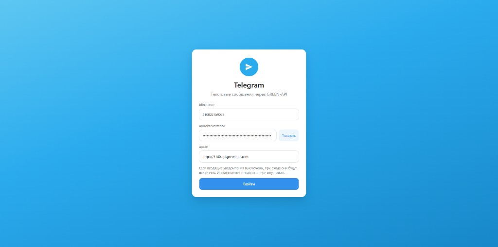
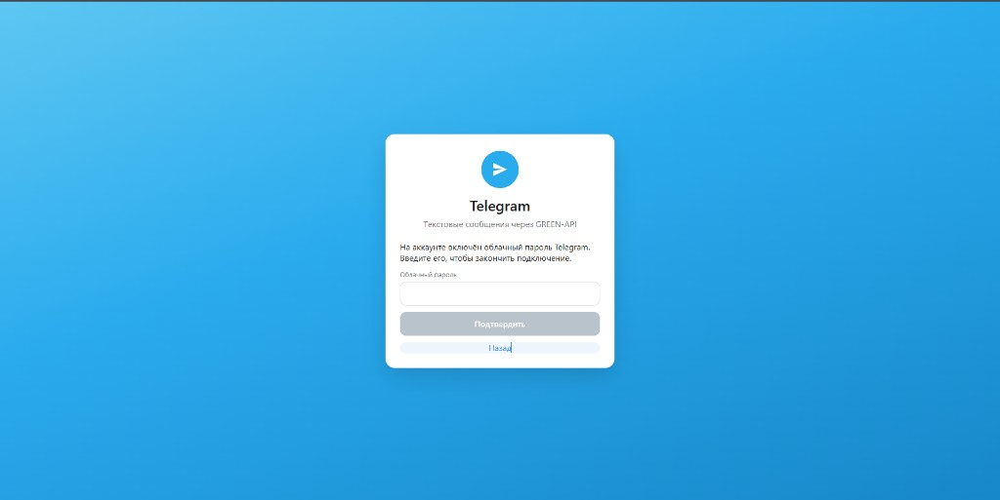
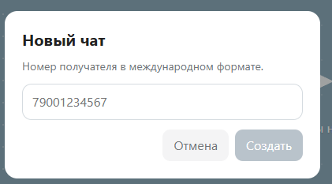
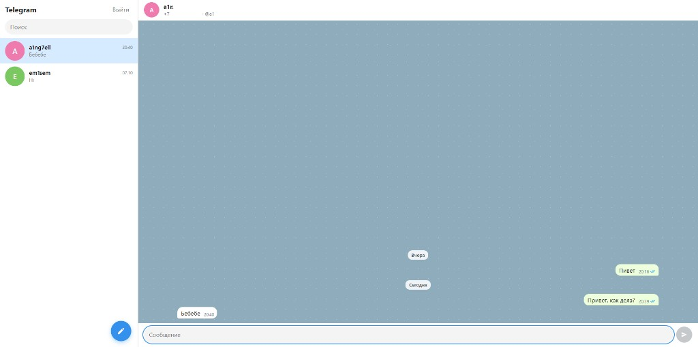

#  Тестовое задание GREEN-API

Пользовательский интерфейс для отправки и получения текстовых сообщений Telegram через [GREEN-API](https://green-api.com/telegram).

Стек: React, TypeScript, Vite, SCSS.

## Что реализовано

- Вход по данным инстанса GREEN-API: `idInstance`, `apiTokenInstance`, `apiUrl`.
- Подключение Telegram по QR-коду, если инстанс ещё не авторизован. При облачном пароле Telegram его можно ввести на следующем шаге.
- Создание личного чата по номеру телефона. Номер проверяется методом [CheckAccount](https://green-api.com/telegram/docs/api/service/CheckAccount/).
- Отправка только текстовых сообщений методом [SendMessage](https://green-api.com/telegram/docs/api/sending/SendMessage/).
- Получение ответов через [HTTP API](https://green-api.com/telegram/docs/api/receiving/technology-http-api/): `ReceiveNotification`, затем `DeleteNotification`.
- Простой интерфейс в два столбца по образцу [Telegram Web](https://web.telegram.org/): список чатов и переписка.

При первом входе приложение включает входящие уведомления и очищает `webhookUrl`, иначе очередь HTTP API не отдаёт сообщения. Инстанс после этого может перезапускаться несколько минут.

## Что требуется

- [Node.js](https://nodejs.org/) 20 или новее и npm.
- Инстанс Telegram в личном кабинете GREEN-API и его параметры:
  - `idInstance`
  - `apiTokenInstance`
  - `apiUrl` (для этого инстанса хост вида `https://4100.api.green-api.com`)
- Телефон с Telegram, чтобы авторизовать инстанс и ответить на сообщение.
- Номер получателя в международном формате, без плюса, пробелов и скобок. Пример: `79001234567`.

В форме входа уже подставлены данные инстанса из задания. Их можно заменить на свои.

## Локальный запуск

В корне проекта:

```bash
npm install
npm run dev
```

Vite выведет локальный адрес, обычно [http://localhost:5173/](http://localhost:5173/). Если этот порт занят, в консоли будет указан другой.

Сборка и просмотр production-версии:

```bash
npm run build
npm run preview
```

## Как проверить

1. Откройте адрес из консоли и нажмите «Войти».
2. Если показан QR-код, в Telegram на телефоне откройте **Настройки → Устройства → Подключить устройство** и отсканируйте его.
3. Нажмите кнопку с карандашом, введите номер получателя и создайте чат.
4. Отправьте текстовое сообщение.
5. Ответьте на него в Telegram. Ответ появится в том же чате.

## Скриншоты сайта

1. Стартовое окно



2. Окно с двухфакторной аунтификацией (облачный пароль)



3. Главная страница диалогов


4. Окошко с добавлением нового чата по номеру получателя



5. Диалог с пользователем




